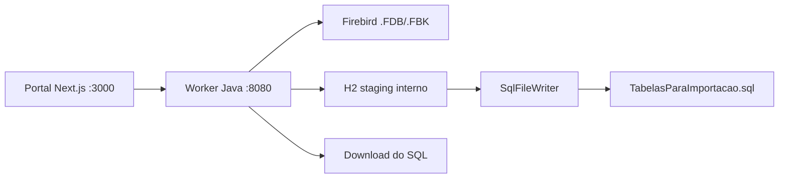

# Software Design Document
## Migrador Web LC - Base Funcional SYSPDV

**Data:** 2026-04-23  
**Status:** Base funcional validada e pronta para evolucao  
**Escopo principal:** `syspdv`  
**Objetivo deste documento:** servir como ponto de referencia oficial para os proximos ajustes do projeto

---

## 1. Visao Geral

O projeto atual entrega um portal web local para processar bancos Firebird e gerar um dump final no padrao **MySQL 5.5.38**, usando como base a estrutura oficial do `banco_novo.sql`.

O ponto importante desta versao e:

- O H2 continua existindo apenas como camada interna de staging.
- O arquivo final de entrega nao deve expor sintaxe H2.
- O dump final precisa manter a cara do exemplo do `banco_novo.sql`, com `CREATE TABLE`, `DROP TABLE IF EXISTS`, `AUTO_INCREMENT`, `ENGINE=InnoDB` e `DEFAULT CHARSET=latin1`.
- O fluxo validado atualmente e o do pacote `syspdv`.

---

## 2. Objetivo do Produto

O sistema permite:

- Selecionar o sistema de origem.
- Selecionar UF e cidade.
- Enviar o arquivo `.FDB` ou `.FBK`.
- Processar a migracao localmente.
- Exibir logs e progresso em tempo real.
- Gerar e disponibilizar o arquivo `TabelasParaImportacao.sql`.

---

## 3. Arquitetura Atual

### 3.1 Componentes

- `portal/`
- `worker-java/`
- `START_ALL.bat`
- `STOP_ALL.bat`

### 3.2 Fluxo macro

### 3.3 Responsabilidades por camada

- `portal`: interface, selecao de UF/cidade, upload, monitoramento e download.
- `worker-java`: orquestracao da migracao, leitura do banco de origem, staging interno e geracao do dump.
- `START_ALL.bat`: sobe portal e worker juntos.
- `STOP_ALL.bat`: encerra os processos locais do portal e do worker.

---

## 4. Estrutura Funcional

### 4.1 Portal web

Arquivos principais:

- `portal/src/app/page.tsx`
- `portal/src/app/api/download/[jobId]/route.ts`

Funcao do portal:

- Carregar estados via `GET /api/estados`.
- Carregar cidades via `GET /api/cidades?uf=XX`.
- Enviar o arquivo para `POST /api/processar`.
- Consultar status em `GET /api/status/{jobId}`.
- Liberar download em `GET /api/download/{jobId}`.

### 4.2 Worker Java

Arquivos principais:

- `worker-java/src/br/com/lcsistemas/syspdv/AppWorker.java`
- `worker-java/src/br/com/lcsistemas/syspdv/engine/MigracaoEngine.java`
- `worker-java/src/br/com/lcsistemas/syspdv/sql/SqlFileWriter.java`
- `worker-java/src/br/com/lcsistemas/syspdv/sql/SqlFileRunner.java`
- `worker-java/src/br/com/lcsistemas/syspdv/sql/ReferenceData.java`
- `worker-java/src/br/com/lcsistemas/syspdv/firebird/GerenciadorFirebird.java`

Funcao do worker:

- Receber upload.
- Restaurar `.FBK` quando necessario.
- Montar a configuracao da migracao.
- Executar os steps da engine.
- Gerar o SQL final.
- Expor logs, status e download.

---

## 5. Contrato de API do Worker

### 5.1 `GET /api/estados`

Retorna a lista de estados usados no formulario do portal.

### 5.2 `GET /api/cidades?uf=XX`

Retorna as cidades associadas a UF informada.

### 5.3 `POST /api/processar`

Recebe `multipart/form-data` com:

- `sistema`
- `uf`
- `cidade`
- `regime`
- `arquivo`

Resposta:

- `jobId` quando a fila do processamento foi criada.

### 5.4 `GET /api/status/{jobId}`

Retorna:

- status do job
- progresso atual
- total de steps
- logs acumulados

### 5.5 `GET /api/download/{jobId}`

Retorna o arquivo final `TabelasParaImportacao.sql`.

---

## 6. Regras de Negocio Validadas

### 6.1 Origem do banco

- O sistema trabalha com bancos Firebird `.FDB`.
- Quando a origem vem em `.FBK`, o worker restaura para `.FDB` antes de iniciar a migracao.

### 6.2 UF e cidade

- A lista de estados fica em memoria como fallback.
- As cidades vem de `cidades.csv` no classpath.
- `ReferenceData` resolve:
  - `UF -> id_estado`
  - `UF + cidade -> id_cidade`

### 6.3 Estrutura de saida

- A saida final deve seguir o padrao MySQL 5.5.38.
- A base do DDL vem do `banco_novo.sql`.
- A engine usa H2 como staging interno.
- O `SqlFileWriter` reutiliza o DDL original do `banco_novo.sql` para a entrega final.

### 6.4 Compatibilidade de dump

Nao devem aparecer no arquivo final:

- `GENERATED BY DEFAULT AS IDENTITY`
- `SELECTIVITY`
- `DEFAULT ON NULL`
- prefixos de schema do H2
- sintaxe interna do H2 que nao exista no modelo MySQL alvo

---

## 7. Fluxo de Execucao

### 7.1 Inicializacao

1. `START_ALL.bat` encerra processos antigos nas portas `3000` e `8080`.
2. O worker e iniciado.
3. O portal e iniciado.
4. O portal consulta o worker para estados e cidades.

### 7.2 Processamento

1. O usuario seleciona sistema, UF, cidade, regime e arquivo.
2. O portal envia o job ao worker.
3. O worker salva o arquivo em `temp`.
4. Se for `.FBK`, o worker restaura o banco.
5. A engine conecta no Firebird de origem.
6. O H2 recebe o bootstrap do `banco_novo.sql`.
7. Os steps da migracao rodam sobre o staging interno.
8. O `SqlFileWriter` gera o dump final em formato MySQL 5.5.38.
9. O portal libera o download.

### 7.3 Finalizacao

- O job termina com `CONCLUIDO` ou `ERRO`.
- O SQL final fica no diretorio temporario do job.
- O download e servido pelo portal.

---

## 8. Estrutura do Dump Final

O arquivo gerado segue o padrao:

- cabecalho MySQL 5.5.38
- definicao das tabelas a partir do `banco_novo.sql`
- inserts dos dados migrados
- ajustes pos-migracao
- footer de fechamento do dump

### 8.1 Fonte do DDL

O `SqlFileWriter` carrega o DDL original em primeiro lugar por:

- classpath
- fallback em disco, se necessario

### 8.2 Papel do H2

O H2 nao e a entrega final. Ele e apenas a camada de apoio para executar o fluxo de migracao e consolidar os dados antes da escrita do dump.

---

## 9. Build e Execucao Local

### 9.1 Scripts principais

- `worker-java/build.bat`
- `worker-java/run_worker_new.bat`
- `START_ALL.bat`
- `STOP_ALL.bat`

### 9.2 Regras do build atual

- O `build.bat` compila o worker.
- O `build.bat` copia `banco_novo.sql`, `cidades.csv`, `reference_data.json` e as classes de apoio para `bin`.
- O `run_worker_new.bat` deve usar `bin` primeiro no classpath.
- O `src` nao deve ganhar prioridade sobre `bin`.

### 9.3 Regra critica de runtime

O worker funcional atual depende de:

- `bin` atualizado
- `banco_novo.sql` no classpath
- `cidades.csv` no classpath
- `run_worker_new.bat` apontando para a versao compilada

---

## 10. Estado Funcional Base

Este e o estado base validado atualmente:

- O portal sobe em `localhost:3000`.
- O worker sobe em `localhost:8080`.
- UF e cidades carregam corretamente.
- O upload do banco funciona.
- O processamento da migracao executa.
- O SQL final e gerado em formato MySQL 5.5.38.
- O dump final usa a estrutura do `banco_novo.sql`.

---

## 11. Pontos de Atencao para Proximas Mudancas

- Nao reintroduzir `src` antes de `bin` no classpath.
- Nao deixar `.class` antigos de `src` sobrescreverem o build novo.
- Nao trocar o `SqlFileWriter` para um fallback que gere H2 como formato final.
- Quando mudar `banco_novo.sql`, verificar se o parser continua mapeando as DDLs.
- Quando mudar estados/cidades, manter `cidades.csv` e `ReferenceData` sincronizados.
- Quando adicionar tabelas novas no fluxo, revisar `LcSchema.TABLE_ORDER`.

---

## 12. Observacoes Sobre Codigo Legado

O repositorio ainda contem pastas e classes historicas de outros fluxos:

- `br.com.lcsistemas.gdoor.*`
- `br.com.lcsistemas.host.*`

Elas permanecem no codigo, mas o ponto base funcional atual desta entrega e o pacote:

- `br.com.lcsistemas.syspdv.*`

---

## 13. Referencias Tecnicas Principais

- `worker-java/src/br/com/lcsistemas/syspdv/AppWorker.java`
- `worker-java/src/br/com/lcsistemas/syspdv/engine/MigracaoEngine.java`
- `worker-java/src/br/com/lcsistemas/syspdv/sql/SqlFileWriter.java`
- `worker-java/src/br/com/lcsistemas/syspdv/sql/SqlFileRunner.java`
- `worker-java/src/br/com/lcsistemas/syspdv/sql/ReferenceData.java`
- `worker-java/src/br/com/lcsistemas/syspdv/firebird/GerenciadorFirebird.java`
- `portal/src/app/page.tsx`
- `worker-java/build.bat`
- `worker-java/run_worker_new.bat`
- `START_ALL.bat`

---

## 14. Conclusao

Este documento registra a base funcional atual do sistema `syspdv`.
Ele deve ser usado como referencia principal para novos ajustes, sempre respeitando:

- fluxo local de portal + worker
- H2 apenas como staging
- saida final em MySQL 5.5.38
- estrutura do `banco_novo.sql`

