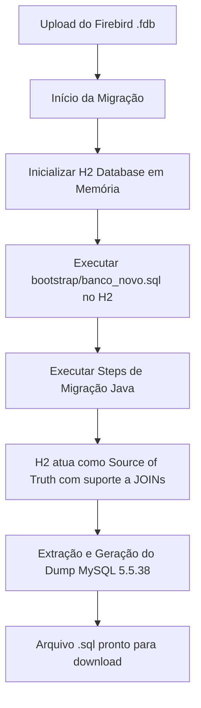

# Software Design Document (SDD) - Migrador Web v3.0
## Spec-Driven Development (SDD)

### 1. Objetivo e Visão Geral
Transformar o sistema de migração Java em um componente **Self-Contained** e **SaaS-Ready** para o Portal de Migração. O sistema deve ser capaz de realizar migrações complexas (Firebird → MySQL) sem depender de uma instalação externa de MySQL, garantindo a integridade dos dados e o suporte a consultas SQL avançadas (JOINs, Updates, etc.).

### 2. Arquitetura Técnica
A nova arquitetura abandona simuladores em memória (`SqlMemoryStore`) em favor de um motor SQL real e embutido.

#### Componentes Principais:
- **Embedded Database**: H2 Database em modo de compatibilidade MySQL (`MODE=MySQL`).
- **Bootstrap Engine**: Leitor e executor de scripts SQL legados (`banco_novo.sql`).
- **Migration Engine**: Orquestrador que gerencia o ciclo de vida do banco H2 e dos Steps.
- **MySQL Dumper**: Gerador de arquivos `.sql` compatíveis com o padrão MySQL 5.5.38.

### 3. Fluxo de Execução

### 4. Definições de Dados
- **Banco de Rascunho**: `jdbc:h2:mem:lc_sistemas;MODE=MySQL;DATABASE_TO_UPPER=FALSE;CASE_INSENSITIVE_IDENTIFIERS=TRUE`
- **Source of Truth (Schema)**: `br/com/lcsistemas/syspdv/resource/banco_novo.sql` (agora parte do projeto)
- **Compatibility**: O dump gerado deve ser compatível com MySQL 5.5.38, respeitando a ordem das tabelas definida em `LcSchema.java`.

### 5. Regras de Negócio e Integridade
- **Preservação de IDs**: O bootstrap do `banco_novo.sql` garante que IDs fixos (Cidades, Estados, Unidades Padrão) sejam mantidos.
- **Support for Joins**: Steps como `ProdutoStep` agora podem realizar `INNER JOIN` com a tabela `unidade` ou `categoria` dentro do próprio H2 para validar referências.
- **Independência**: Nenhuma configuração de banco local ou driver externo de cliente é necessária.

### 6. Plano de Implementação
1. Adição da biblioteca `h2-*.jar`.
2. Implementação do `SqlFileRunner` para processar arquivos `.sql` de grande porte (2MB+).
3. Refatoração do `MigracaoEngine` para substituir o modo mock pelo modo H2.
4. Implementação do novo gerador de dump baseado em `JDBC Metadata`.

---
*Este documento é a especificação técnica para o desenvolvimento do sistema de migração Web.*
